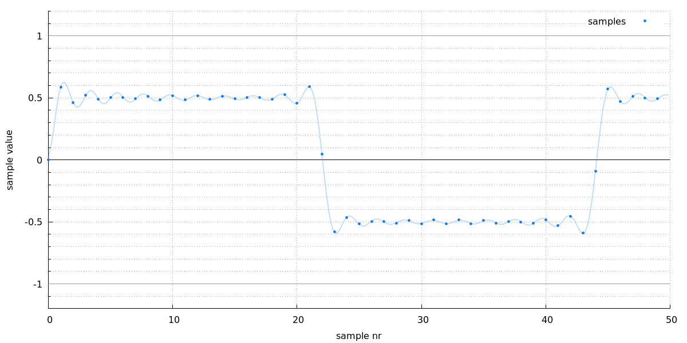

**Table of Contents**

* [Intro](#intro)
* [Command line options](#command-line-options)

# Intro

A script that generates and executes gnuplot commands for plotting audio samples.

The simplest invocation is:

    ]$ plot_audio_samples -i some_audio.flac

# Command line options

Here's the full help:

    ]$ plot_audio_samples -h
    Usage:
      plot_audio_samples -i INPUT_FILE [optional arguments]

      Required:
        -i | --input INPUT_FILE     - input file

      Optional:
        -o | --output OUTPUT_FILE   - output file (default is same as input with the
                                      extension changed to "png")
        -f | --force                - force overwrite output file
        --gp-commands               - don't invoke gnuplot, just print gnuplot
                                      commands to stdout

        -s | --start START_POS      - start position in samples     (default: 0)
        -l | --length LENGTH        - length in samples             (default: 50)
        -t | --title TITLE          - title
        --size SIZE                 - size of the graph (default is medium)

        -h | --help                 - this help message

    Plot the samples and upsampled waveform of the first channel from the input file.

    The input file is upsampled 8x to obtain data for the waveform.

    SIZE can be either a keyword or an actual size in format WIDTHxHEIGHT. Possible
    keywords and corresponding sizes:
      small:        800x400
      medium:       1200x600
      large | big:  1600x800
